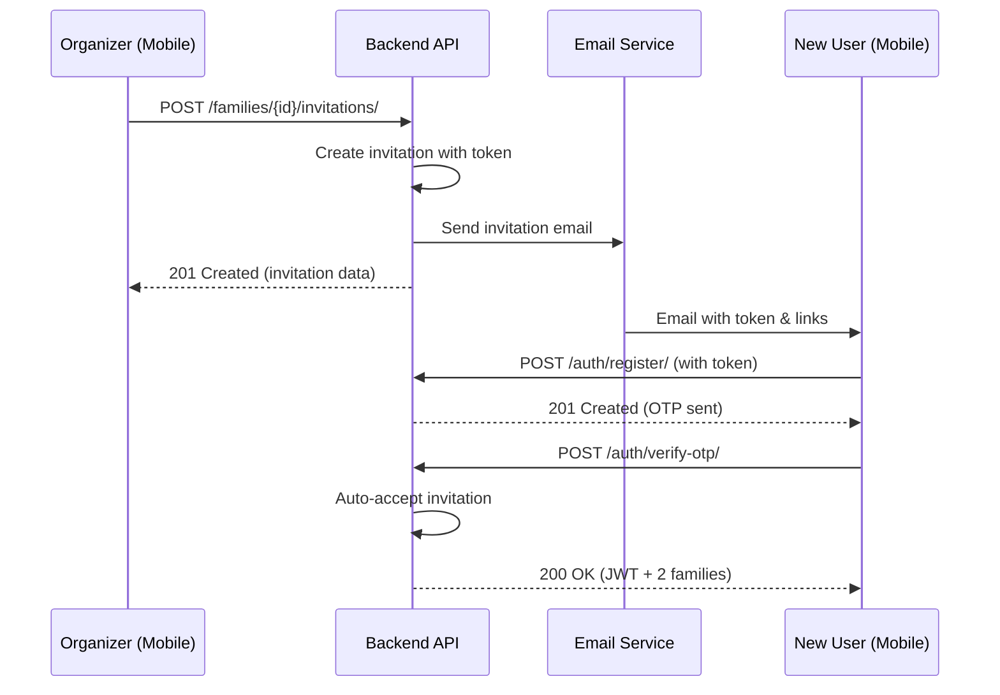
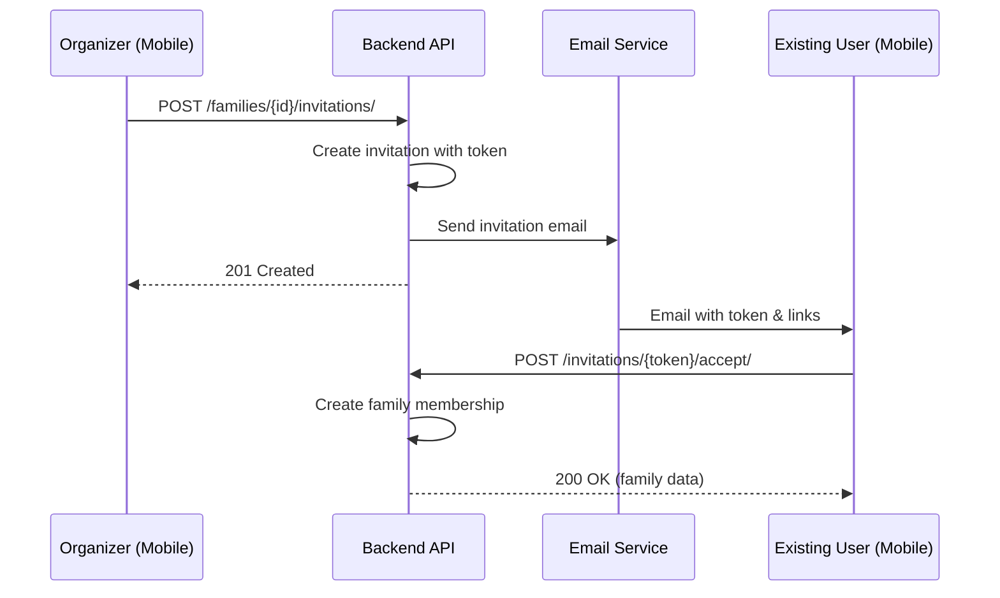
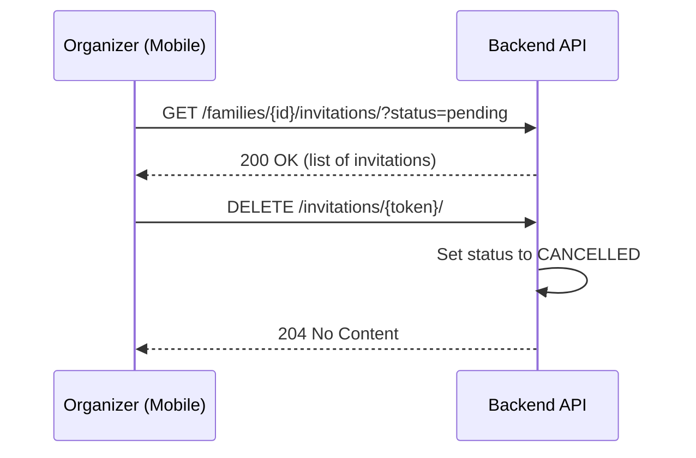

# Family Invitation System - API Guide

**Version:** 1.0
**Status:** Production Ready
**Last Updated:** 2025-01-13

---

## Overview

The Family Invitation System enables ORGANIZERS to invite family members via email. Invitations can be accepted during signup (auto-join) or by existing users. This guide provides complete API documentation for mobile app integration.

## Table of Contents

1. [Quick Start](#quick-start)
2. [API Endpoints](#api-endpoints)
3. [User Flows](#user-flows)
4. [Error Handling](#error-handling)
5. [Testing Guide](#testing-guide)

---

## Quick Start

### Key Concepts

- **Roles**: ORGANIZER (family admin), PARENT, CHILD
- **Invitation Token**: UUID sent via email, used for signup/acceptance
- **Expiration**: Invitations expire after 7 days
- **Auto-Join**: New users can join family during registration

### Authentication

All endpoints except accept/decline require JWT authentication:

```http
Authorization: Bearer <access_token>
```

---

## API Endpoints

### 1. Create Invitation

**Endpoint:** `POST /api/v1/families/{family_public_id}/invitations/`
**Permission:** ORGANIZER only
**Description:** Send an invitation email to a new family member

**Request:**
```json
{
  "invitee_email": "john@example.com",
  "role": "parent"
}
```

**Response:** `201 Created`
```json
{
  "id": 123,
  "public_id": "uuid-here",
  "token": "invitation-token-uuid",
  "invitee_email": "john@example.com",
  "role": "parent",
  "status": "pending",
  "expires_at": "2025-01-20T12:00:00Z",
  "is_expired": false,
  "inviter": {
    "id": 1,
    "public_id": "user-uuid",
    "email": "organizer@example.com",
    "first_name": "Jane",
    "last_name": "Doe"
  },
  "family_name": "Doe Family",
  "created_at": "2025-01-13T12:00:00Z"
}
```

**Errors:**
- `400` - Email already a family member
- `400` - Pending invitation already exists
- `403` - User not ORGANIZER
- `404` - Family not found

**Mobile Implementation:**
```typescript
async function sendInvitation(familyId: string, email: string, role: 'parent' | 'child') {
  const response = await api.post(`/api/v1/families/${familyId}/invitations/`, {
    invitee_email: email,
    role: role
  });

  return response.data;
}
```

---

### 2. List Family Invitations

**Endpoint:** `GET /api/v1/families/{family_public_id}/invitations/`
**Permission:** ORGANIZER only
**Description:** View all invitations for a family

**Query Parameters:**
- `status` (optional): Filter by status (`pending`, `accepted`, `declined`, `expired`, `cancelled`)

**Request:**
```http
GET /api/v1/families/uuid-here/invitations/?status=pending
```

**Response:** `200 OK`
```json
[
  {
    "id": 123,
    "public_id": "uuid",
    "token": "token-uuid",
    "invitee_email": "john@example.com",
    "role": "parent",
    "status": "pending",
    "expires_at": "2025-01-20T12:00:00Z",
    "is_expired": false,
    "inviter": { ... },
    "family_name": "Doe Family",
    "created_at": "2025-01-13T12:00:00Z"
  }
]
```

**Mobile Implementation:**
```typescript
async function getInvitations(familyId: string, status?: string) {
  const params = status ? { status } : {};
  const response = await api.get(`/api/v1/families/${familyId}/invitations/`, { params });

  return response.data;
}
```

---

### 3. Cancel Invitation

**Endpoint:** `DELETE /api/v1/invitations/{invitation_token}/`
**Permission:** ORGANIZER (must be from inviter's family)
**Description:** Cancel a pending invitation

**Response:** `204 No Content`

**Errors:**
- `400` - Invitation already accepted/declined
- `403` - User not ORGANIZER of invitation's family
- `404` - Invitation not found

**Mobile Implementation:**
```typescript
async function cancelInvitation(token: string) {
  await api.delete(`/api/v1/invitations/${token}/`);
}
```

---

### 4. Accept Invitation (Existing User)

**Endpoint:** `POST /api/v1/invitations/{invitation_token}/accept/`
**Permission:** Authenticated (email must match invitee_email)
**Description:** Accept an invitation and join the family

**Response:** `200 OK`
```json
{
  "message": "Invitation accepted successfully",
  "family": {
    "public_id": "family-uuid",
    "name": "Doe Family",
    "member_count": 3
  },
  "membership": {
    "role": "parent",
    "joined_at": "2025-01-13T12:00:00Z"
  }
}
```

**Errors:**
- `400` - Invitation expired
- `400` - Invitation not pending
- `400` - Email mismatch
- `400` - Already a family member
- `401` - Not authenticated

**Mobile Implementation:**
```typescript
async function acceptInvitation(token: string) {
  const response = await api.post(`/api/v1/invitations/${token}/accept/`);
  return response.data.family;
}
```

---

### 5. Decline Invitation

**Endpoint:** `POST /api/v1/invitations/{invitation_token}/decline/`
**Permission:** Authenticated (email must match invitee_email)
**Description:** Decline an invitation

**Response:** `200 OK`
```json
{
  "message": "Invitation declined"
}
```

**Errors:** Same as Accept Invitation

**Mobile Implementation:**
```typescript
async function declineInvitation(token: string) {
  await api.post(`/api/v1/invitations/${token}/decline/`);
}
```

---

### 6. Signup with Invitation (Auto-Join)

**Endpoint:** `POST /api/auth/register/`
**Permission:** None (public)
**Description:** Register a new user with an invitation token to auto-join family

**Request:**
```json
{
  "email": "john@example.com",
  "first_name": "John",
  "last_name": "Doe",
  "password": "SecurePassword123!",
  "password_confirm": "SecurePassword123!",
  "invitation_token": "invitation-token-uuid"
}
```

**Response:** `201 Created`
```json
{
  "message": "User registered successfully. Check your email for verification code.",
  "email": "john@example.com"
}
```

**Then verify OTP:**
```json
POST /api/auth/verify-otp/
{
  "email": "john@example.com",
  "otp": "123456"
}
```

**OTP Verification Response:** `200 OK`
```json
{
  "access": "jwt-access-token",
  "refresh": "jwt-refresh-token",
  "user": {
    "email": "john@example.com",
    "first_name": "John",
    "last_name": "Doe",
    "email_verified": true
  },
  "families": [
    {
      "public_id": "invited-family-uuid",
      "name": "Doe Family",
      "role": "parent"
    },
    {
      "public_id": "auto-created-uuid",
      "name": "John's Family",
      "role": "organizer"
    }
  ],
  "family": { ... },
  "invited_family": {
    "public_id": "invited-family-uuid",
    "name": "Doe Family",
    "role": "parent"
  }
}
```

**Errors:**
- `400` - Invalid invitation token
- `400` - Invitation expired
- `400` - Email doesn't match invitation

**Mobile Implementation:**
```typescript
async function signupWithInvitation(
  email: string,
  firstName: string,
  lastName: string,
  password: string,
  invitationToken: string
) {
  // Step 1: Register
  await api.post('/api/auth/register/', {
    email,
    first_name: firstName,
    last_name: lastName,
    password,
    password_confirm: password,
    invitation_token: invitationToken
  });

  // Step 2: Wait for OTP email
  // Step 3: Verify OTP (user joins family automatically)
  const response = await api.post('/api/auth/verify-otp/', {
    email,
    otp: userEnteredOtp
  });

  return response.data; // Contains both families
}
```

---

## User Flows

### Flow 1: Organizer Invites New User



### Flow 2: Organizer Invites Existing User



### Flow 3: Organizer Manages Invitations



---

## Error Handling

### Common Error Codes

| Code | Meaning | Common Causes |
|------|---------|---------------|
| 400 | Bad Request | Invalid data, expired invitation, duplicate invitation |
| 401 | Unauthorized | Missing or invalid JWT token |
| 403 | Forbidden | Not ORGANIZER, wrong family |
| 404 | Not Found | Invalid family ID or invitation token |
| 500 | Server Error | Backend issue (contact support) |

### Error Response Format

```json
{
  "detail": "This invitation has expired"
}
```

Or for field-specific errors:

```json
{
  "invitee_email": ["This email is already a member of the family"],
  "invitation_token": ["Invalid or expired invitation token"]
}
```

### Mobile Error Handling Best Practices

```typescript
try {
  await sendInvitation(familyId, email, role);
} catch (error) {
  if (error.response?.status === 400) {
    // Show user-friendly message
    const message = error.response.data.detail ||
                   error.response.data.invitee_email?.[0] ||
                   'Invalid invitation';
    showError(message);
  } else if (error.response?.status === 403) {
    showError('Only organizers can send invitations');
  } else {
    showError('Something went wrong. Please try again.');
  }
}
```

---

## Testing Guide

### Manual Testing Flow

1. **Create Invitation:**
   ```bash
   curl -X POST http://localhost:8000/api/v1/families/{family_id}/invitations/ \
     -H "Authorization: Bearer ${TOKEN}" \
     -H "Content-Type: application/json" \
     -d '{"invitee_email": "test@example.com", "role": "parent"}'
   ```

2. **Check Email in Mailpit:**
   - Open http://localhost:8025
   - Find invitation email
   - Copy invitation token from email

3. **Accept Invitation:**
   ```bash
   curl -X POST http://localhost:8000/api/v1/invitations/{token}/accept/ \
     -H "Authorization: Bearer ${INVITEE_TOKEN}"
   ```

### Integration Testing

See `backend/apps/users/tests/test_invitation_signup.py` for E2E test examples.

### Mobile App Testing Checklist

- [ ] Organizer can create invitation
- [ ] Invitation email received with correct details
- [ ] New user can signup with token (auto-joins family)
- [ ] Existing user can accept invitation from email link
- [ ] User can decline invitation
- [ ] Organizer can view pending invitations
- [ ] Organizer can cancel invitation
- [ ] Expired invitations show appropriate error
- [ ] Proper error messages for all failure cases
- [ ] User has both families after signup with token

---

## Advanced Topics

### Deep Linking (Mobile)

**Email Link Format:**
```
famapp://invitation/accept?token={invitation_token}
```

**Mobile Handler:**
```typescript
// React Native Deep Link Handler
Linking.addEventListener('url', (event) => {
  const { url } = event;
  if (url.includes('/invitation/accept')) {
    const token = new URL(url).searchParams.get('token');
    handleInvitationAccept(token);
  }
});
```

### Invitation States

| Status | Description | Mobile Action |
|--------|-------------|---------------|
| PENDING | Awaiting response | Show accept/decline buttons |
| ACCEPTED | User joined family | Show "Already accepted" |
| DECLINED | User declined | Show "Declined" (can re-invite) |
| EXPIRED | Past expiration date | Show "Expired" (can re-invite) |
| CANCELLED | Organizer cancelled | Show "Cancelled" |

### Rate Limiting

- Maximum 10 invitations per family per hour
- Maximum 3 invitations to same email per 24 hours
- Celery handles email sending asynchronously

### Security Considerations

1. **Token Security**: UUID tokens are cryptographically random
2. **Email Validation**: Case-insensitive matching
3. **Expiration**: 7-day default (configurable)
4. **Permission Checks**: ORGANIZER-only for management
5. **Invite-only Accept**: Only invitee email can accept

---

## Support & Contact

- **Documentation**: `docs/API_INVITATION_GUIDE.md`
- **Technical Details**: `INVITATION_TODO.md`
- **Backend Tests**: `backend/apps/users/tests/test_invitation*.py`
- **Issues**: Create GitHub issue with `[invitation]` tag

---

**Built with TDD methodology** ✅
**128 tests passing** ✅
**Production ready** ✅
