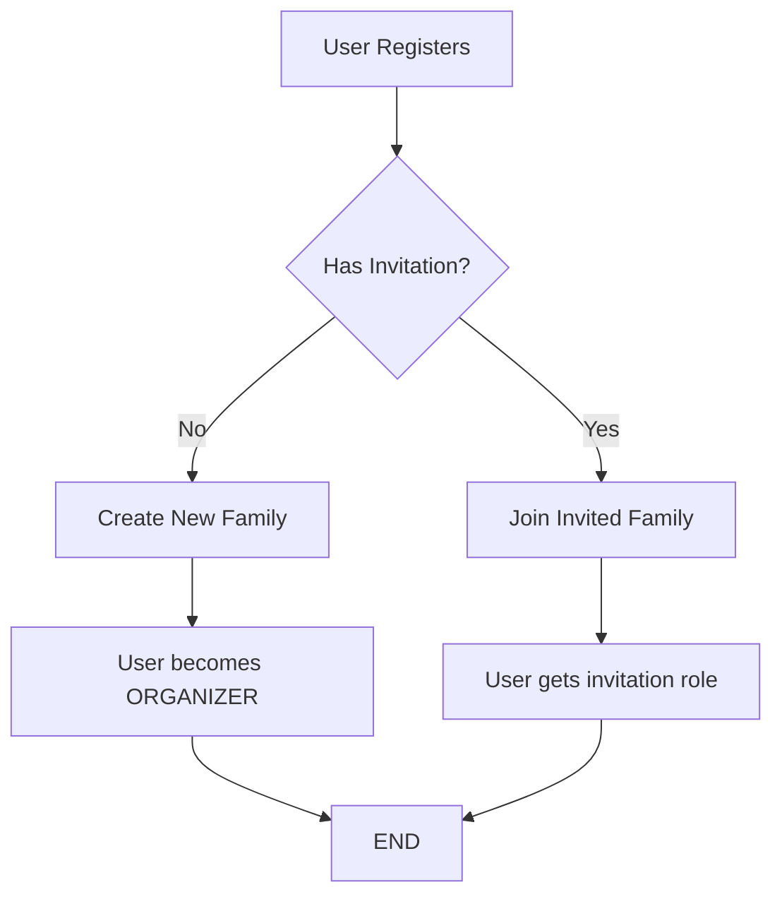
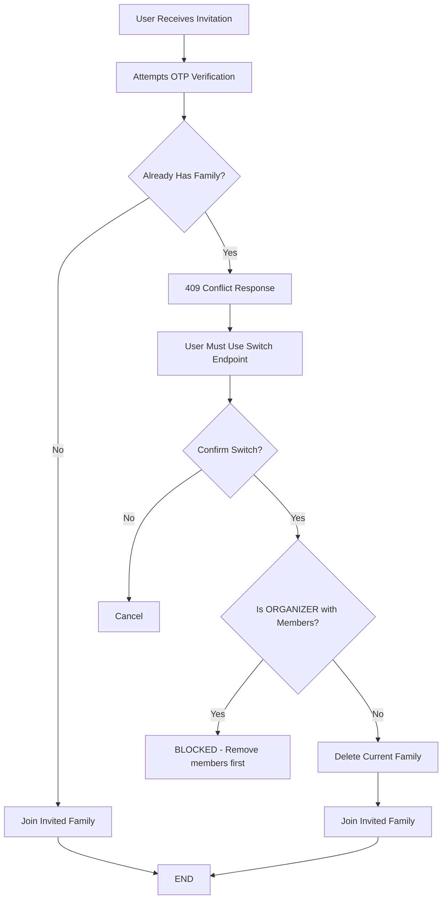

# FamApp Authentication Flow Changes

**Date:** October 14, 2025
**Authors:** Ham Dog & TC (Tenacious Code)

## Overview

This document outlines the major changes made to FamApp's authentication and family membership system to implement a simplified **one-user-one-family** model with OTP-based verification.

---

## Table of Contents

1. [Architecture Changes](#architecture-changes)
2. [OTP-Only Verification](#otp-only-verification)
3. [One-User-One-Family Model](#one-user-one-family-model)
4. [Family Switching Flow](#family-switching-flow)
5. [API Changes](#api-changes)
6. [Response Formats](#response-formats)
7. [Migration Guide](#migration-guide)

---

## Architecture Changes

### Before
- Magic link email verification
- Multi-family membership (users could belong to multiple families)
- Role was contextual per-family (complex permission checks)
- Auto-created family for ALL new users (even invited ones)

### After
- OTP-only email verification (6-digit code)
- **One user = One family** (enforced at database level)
- Role is a single value (simplified permissions)
- Smart family creation (only when needed)

---

## OTP-Only Verification

### What Changed

**Removed:**
- Magic link email verification (`/api/v1/auth/verify-email/`)
- Magic link resend (`/api/v1/auth/resend-verification/`)
- `send_verification_email()` function

**Added:**
- OTP verification (`/api/v1/auth/verify-otp/`)
- OTP resend with rate limiting (`/api/v1/auth/resend-otp/`)
- Auto-send OTP on blocked login (civilized UX)

### Registration Flow

```
POST /api/v1/auth/register/
{
  "email": "user@example.com",
  "password": "secure_password",
  "first_name": "John",
  "last_name": "Doe",
  "invitation_token": "uuid-optional"
}

Response (201):
{
  "user": {
    "email": "user@example.com",
    "email_verified": false,
    ...
  },
  "message": "Registration successful! Please check your email for your verification code.",
  "email_sent": true,
  "requires_email_verification": true
}
```

**OTP Email Contains:**
- 6-digit code (e.g., "123456")
- Expires in 10 minutes
- Stored in Redis

### Login Flow with Auto-OTP

```
POST /api/v1/auth/login/
{
  "email": "user@example.com",
  "password": "password"
}

If email NOT verified:
Response (400):
{
  "non_field_errors": ["Email verification required. We've sent you a new verification code."],
  "requires_email_verification": true,
  "email": "user@example.com",
  "email_sent": true  // OTP auto-sent!
}

If email verified:
Response (200):
{
  "access": "jwt_access_token",
  "refresh": "jwt_refresh_token",
  "user": {
    "email": "user@example.com",
    "role": "organizer",
    "family": {
      "public_id": "uuid",
      "name": "John's Family"
    },
    ...
  }
}
```

**Rate Limiting:**
- OTP can only be sent once per 60 seconds
- Prevents spam/abuse

---

## One-User-One-Family Model

### Core Rules

1. **One user can only belong to ONE family at a time**
2. **Two signup paths:**
   - Create new family (become ORGANIZER)
   - Join existing family via invitation (PARENT/CHILD)
3. **Switching families requires explicit action**

### New User Flow (90% case)



**Implementation:**
- `verify_otp()` checks for `invitation_token` in Redis
- If invitation exists → Join family ONLY (skip auto-create)
- If no invitation → Create "{FirstName}'s Family" (ORGANIZER)

**Code Example:**
```python
# In otp_views.py verify_otp()
if invitation_token_str:
    # Has invitation - ONLY join invited family
    accept_invitation(user, invitation)
else:
    # No invitation - create own family
    create_family_for_user(user)
```

### Existing User Flow (10% edge case)



---

## Family Switching Flow

### New Endpoint

```
POST /api/v1/invitations/{invitation_token}/switch-family/
Authorization: Bearer {jwt_token}

Request:
{
  "confirm": true  // Required explicit confirmation
}

Success (200):
{
  "detail": "Successfully switched families.",
  "family": {
    "public_id": "uuid",
    "name": "New Family Name",
    ...
  },
  "role": "parent"
}
```

### Safety Rails

**1. Explicit Confirmation Required**
```json
// First call without confirm
{
  "detail": "You must confirm this action by setting 'confirm' to true.",
  "warning": "Switching families is IRREVERSIBLE. You will leave your current family.",
  "current_family": {
    "public_id": "uuid",
    "name": "My Current Family",
    "role": "organizer"
  },
  "new_family": {
    "public_id": "uuid2",
    "name": "Invited Family",
    "role": "parent"
  }
}
```

**2. ORGANIZER Protection**
```json
// If ORGANIZER with other members
{
  "detail": "You cannot leave this family as the organizer while other members exist. Please remove all other members first, or transfer ownership.",
  "other_members_count": 3
}
```

**3. Automatic Family Cleanup**
- If user is sole ORGANIZER → Family is deleted when switching
- Prevents orphaned family objects

### Validation During OTP Verification

```python
# In otp_views.py verify_otp()
existing_membership = FamilyMember.objects.filter(user=user).first()

if existing_membership:
    return Response({
        "error": "You already belong to a family. To join another family, please use the family switch feature.",
        "current_family": {
            "public_id": str(existing_membership.family.public_id),
            "name": existing_membership.family.name,
            "role": existing_membership.role,
        },
        "requires_family_switch": True,
    }, status=409)
```

---

## API Changes

### Endpoints Removed

| Endpoint | Method | Reason |
|----------|--------|--------|
| `/api/v1/auth/verify-email/` | POST | Replaced by OTP verification |
| `/api/v1/auth/resend-verification/` | POST | Replaced by OTP resend |

### Endpoints Added

| Endpoint | Method | Description |
|----------|--------|-------------|
| `/api/v1/auth/verify-otp/` | POST | Verify 6-digit OTP code |
| `/api/v1/auth/resend-otp/` | POST | Resend OTP code (rate-limited) |
| `/api/v1/invitations/{token}/switch-family/` | POST | Switch from current family to invited family |

### Endpoints Modified

| Endpoint | Change | Impact |
|----------|--------|--------|
| `/api/v1/auth/login/` | Auto-sends OTP if email unverified | Better UX - users get code automatically |
| `/api/v1/auth/login/` | Returns role + family in user object | Simplified frontend permission checks |
| `/api/v1/auth/profile/` | Returns role + family in user object | Single endpoint for all user data |
| `/api/v1/invitations/{token}/accept/` | Now used only during signup | Existing users must use `/switch-family/` |

---

## Response Formats

### Login Response (New Format)

```json
{
  "access": "eyJ0eXAiOiJKV1QiLCJhbGc...",
  "refresh": "eyJ0eXAiOiJKV1QiLCJhbGc...",
  "user": {
    "id": 1,
    "public_id": "550e8400-e29b-41d4-a716-446655440000",
    "email": "randy@example.com",
    "phone_number": null,
    "first_name": "Randy",
    "last_name": "Rood",
    "is_active": true,
    "email_verified": true,
    "date_joined": "2025-10-14T10:30:00Z",
    "last_login": "2025-10-14T15:45:00Z",
    "role": "organizer",           // ✨ NEW!
    "family": {                     // ✨ NEW!
      "public_id": "660e8400-e29b-41d4-a716-446655440000",
      "name": "The Roods"
    }
  }
}
```

### OTP Verification Response (Invited User)

```json
{
  "access": "jwt_token",
  "refresh": "refresh_token",
  "user": {
    "email": "jenny@example.com",
    "first_name": "Jenny",
    "last_name": "Rood",
    "email_verified": true,
    ...
  },
  "families": [
    {
      "public_id": "uuid",
      "name": "The Roods",
      "role": "parent"
    }
  ],
  "family": {
    "public_id": "uuid",
    "name": "The Roods",
    "role": "parent"
  }
}
```

### OTP Verification Response (New User, No Invitation)

```json
{
  "access": "jwt_token",
  "refresh": "refresh_token",
  "user": {
    "email": "john@example.com",
    "first_name": "John",
    "last_name": "Smith",
    "email_verified": true,
    ...
  },
  "families": [
    {
      "public_id": "uuid",
      "name": "John's Family",
      "role": "organizer"
    }
  ],
  "family": {
    "public_id": "uuid",
    "name": "John's Family",
    "role": "organizer"
  }
}
```

### Conflict Response (User Has Existing Family)

```json
{
  "error": "You already belong to a family. To join another family, please use the family switch feature.",
  "current_family": {
    "public_id": "uuid",
    "name": "John's Family",
    "role": "organizer"
  },
  "requires_family_switch": true
}
```

---

## Migration Guide

### For Frontend Developers

**1. Update Login Flow**

```javascript
// OLD: Check for magic link verification
if (response.requires_email_verification) {
  showMessage("Check your email for verification link");
}

// NEW: Handle OTP flow
if (response.requires_email_verification) {
  // OTP was auto-sent!
  showOTPInput();
  showMessage("We've sent you a verification code");
}
```

**2. Access User Role**

```javascript
// OLD: Fetch family separately, find user's role
const families = await fetchFamilies();
const role = families[0].members.find(m => m.user_id === user.id).role;

// NEW: Role is in user object!
const { role, family } = user;
if (role === 'organizer') {
  showAdminFeatures();
}
```

**3. Handle Family Switching**

```javascript
// NEW: Check for family switch requirement
if (error.requires_family_switch) {
  showConfirmDialog({
    title: "Switch Families?",
    message: `Leave ${error.current_family.name} to join new family?`,
    onConfirm: async () => {
      await fetch(`/api/v1/invitations/${token}/switch-family/`, {
        method: 'POST',
        body: JSON.stringify({ confirm: true })
      });
    }
  });
}
```

### For Mobile Developers

**1. OTP Input Screen**

```typescript
// After registration or blocked login
interface OTPScreenProps {
  email: string;
  onVerified: (tokens: AuthTokens) => void;
}

function OTPScreen({ email, onVerified }: OTPScreenProps) {
  const [otp, setOtp] = useState('');

  const handleVerify = async () => {
    const response = await api.post('/auth/verify-otp/', {
      email,
      otp
    });

    if (response.ok) {
      // Store tokens
      await SecureStore.setItemAsync('access_token', response.data.access);
      await SecureStore.setItemAsync('refresh_token', response.data.refresh);

      // User object includes role and family!
      onVerified(response.data);
    }
  };

  return (
    <OTPInput
      length={6}
      value={otp}
      onChange={setOtp}
      onComplete={handleVerify}
    />
  );
}
```

**2. Permission Guards**

```typescript
// Simple role-based guards
function canInviteMembers(user: User): boolean {
  return user.role === 'organizer';
}

function canEditTodo(user: User, todo: Todo): boolean {
  if (user.role === 'organizer') return true;
  if (user.role === 'parent') return true;
  return todo.assigned_to === user.id;
}
```

### Database Changes

No database migrations required! Changes are purely behavioral:

- Same models (`User`, `Family`, `FamilyMember`, `Invitation`)
- Added validation logic in views
- New endpoints for switching

---

## Testing Guide

### Test Cases for New Flow

**1. New User Registration (No Invitation)**
```bash
# Register
POST /api/v1/auth/register/
{"email": "newuser@test.com", "password": "pass123", "first_name": "New", "last_name": "User"}

# Check email for OTP (e.g., "123456")

# Verify OTP
POST /api/v1/auth/verify-otp/
{"email": "newuser@test.com", "otp": "123456"}

# ✅ Expected: User gets own family as ORGANIZER
```

**2. New User Registration (With Invitation)**
```bash
# Randy invites Jenny
POST /api/v1/families/{randy_family_id}/members/invite/
{"invitee_email": "jenny@test.com", "role": "parent"}

# Jenny registers WITH invitation token
POST /api/v1/auth/register/
{"email": "jenny@test.com", "password": "pass123", ..., "invitation_token": "{invitation_uuid}"}

# Jenny verifies OTP
POST /api/v1/auth/verify-otp/
{"email": "jenny@test.com", "otp": "123456"}

# ✅ Expected: Jenny joins Randy's family ONLY (no auto-created family)
```

**3. Existing User Receives Invitation**
```bash
# John (has own family) receives invitation from Bob
POST /api/v1/families/{bob_family_id}/members/invite/
{"invitee_email": "john@test.com", "role": "parent"}

# John tries to register with invitation (already has account)
# This will fail at OTP verification

# ✅ Expected: 409 Conflict with requires_family_switch: true
```

**4. Family Switching**
```bash
# John decides to switch
POST /api/v1/invitations/{invitation_token}/switch-family/
{"confirm": true}

# ✅ Expected:
# - John's old family deleted (he was sole ORGANIZER)
# - John joins Bob's family as PARENT
```

**5. ORGANIZER Protection**
```bash
# Randy (ORGANIZER with Jenny + kids) tries to switch
POST /api/v1/invitations/{token}/switch-family/
{"confirm": true}

# ✅ Expected: 400 Error - Cannot leave while other members exist
```

**6. Login with Unverified Email**
```bash
# User registers but doesn't verify OTP
POST /api/v1/auth/register/
{...}

# User tries to login
POST /api/v1/auth/login/
{"email": "user@test.com", "password": "pass123"}

# ✅ Expected:
# - 400 Error with requires_email_verification: true
# - email_sent: true (OTP auto-sent)
```

---

## Security Considerations

### OTP Security

**Strengths:**
- 6 digits = 1 million combinations
- Expires in 10 minutes
- Rate-limited (60-second cooldown)
- Stored in Redis (auto-expiry)
- One-time use (deleted after verification)

**Best Practices:**
- Use HTTPS only
- Clear OTP from Redis after use
- Log failed attempts
- Consider account lockout after N failures

### Invitation Security

**UUID Tokens:**
- 128-bit UUID = 340 undecillion combinations
- 7-day expiration
- Can be revoked by ORGANIZER

**Why UUID > OTP for Invitations:**
- Long lifespan (7 days vs 10 minutes)
- Clickable links in emails
- Impossible to brute-force
- URL-safe

### Family Switching Security

**Safeguards:**
- Requires authentication (JWT)
- Explicit confirmation (`confirm: true`)
- Email validation (invitation must match user email)
- ORGANIZER protection (can't abandon family)
- Atomic transactions (all-or-nothing)

---

## Troubleshooting

### Common Issues

**1. "No OTP code found for this email"**
- **Cause:** OTP expired (>10 minutes) or already used
- **Solution:** Use `/api/v1/auth/resend-otp/`

**2. "You already belong to a family"**
- **Cause:** User trying to accept invitation via OTP (existing user flow)
- **Solution:** Use `/api/v1/invitations/{token}/switch-family/` instead

**3. "Please wait before requesting another OTP"**
- **Cause:** Rate limiting (60-second cooldown)
- **Solution:** Wait 60 seconds

**4. "Cannot leave family as organizer while other members exist"**
- **Cause:** ORGANIZER trying to switch with active members
- **Solution:** Remove other members first, or transfer ORGANIZER role

**5. OTP email not received**
- Check spam folder
- Verify email address is correct
- Check Mailpit (local dev): http://localhost:8025
- Use `/api/v1/auth/resend-otp/`

---

## Future Enhancements

### Possible Additions

1. **Transfer Ownership**
   - Allow ORGANIZER to transfer role before leaving
   - Endpoint: `POST /api/v1/families/{id}/transfer-ownership/`

2. **Family Deletion Confirmation**
   - Require extra confirmation when deleting family with data
   - Check for orphaned todos, schedules, etc.

3. **SMS OTP**
   - Support phone number + SMS OTP flow
   - Fallback if email unavailable

4. **Backup Codes**
   - Generate one-time backup codes during registration
   - Use if OTP email fails

5. **Multi-Factor Authentication (MFA)**
   - Optional TOTP (Google Authenticator)
   - Biometric authentication (mobile)

---

## Summary

### Key Takeaways

✅ **Simplified Model:** One user = One family
✅ **Better UX:** OTP auto-sent on blocked login
✅ **Cleaner API:** Role + family in user object
✅ **Safety First:** ORGANIZER protection, explicit confirmations
✅ **Production Ready:** Tested, formatted, committed

### Commit History

| Commit | Description |
|--------|-------------|
| `abc62cc` | Split auth views into focused modules + OTP-only verification |
| `822aaef` | Fix: Only create auto-family when user has no invitation |
| `92fc529` | Enforce one-user-one-family rule with family switching |
| `d23b2d3` | Add role and family to user payload in auth responses |

---

**Questions or Issues?**
Contact: Ham Dog & TC
Repository: `famapp-django-backend`
Last Updated: October 14, 2025
